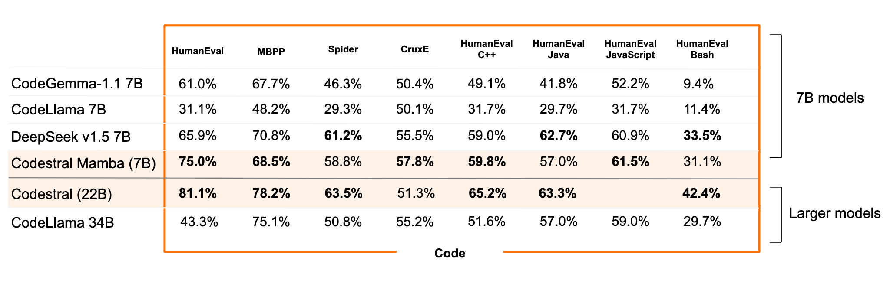

## Codestral Mamba 7B

Modelo de linguagem da série Mamba2, desenvolvido para tarefas de geração de código. Especializado em criar soluções de programação de maneira eficiente. Oferece uma abordagem otimizada para a criação de código, sendo útil para várias linguagens e tipos de desenvolvimento.

- **Desenvolvido por:** Mistral AI
- **Arquitetura:**  Baseada em Mamba.

---
## 🔍 Arquitetura

Utiliza arquitetura de Mamba ao invés de tranformers, oferencendo a vantagem de inferência em tempo linear e a capacidade (teórica) de modelar sequências de comprimento infinito. Isso permite que os usuários interajam extensivamente com o modelo, recebendo respostas rápidas, independentemente do tamanho da entrada. Especialmente relevante para casos de uso voltados à análise e geração de códigos de programação.


| **Recurso**                | **Transformer**                           | **Mamba2**                                |
|----------------------------|------------------------------------------|-------------------------------------------|
| **Tipo de Arquitetura**     | Baseada em Atenção                       | Modelo de Espaço de Estado (SSM)          |
| **Mecanismo Central**       | Foca igualmente em todas as partes da entrada | Foca apenas nas partes mais importantes |
| **Eficiência**              | Mais lento à medida que o tamanho da entrada aumenta | Mais rápido, mesmo com entradas grandes  |
| **Gerenciamento de Contexto** | Limitado pela quantidade de entrada que pode processar | Gerenciamento de contexto ilimitado      |
| **Inovações Principais**    | Divide a entrada em partes menores para entendê-la | Processa seletivamente a entrada, otimizando para velocidade |
| **Velocidade de Treinamento e Inferência** | Mais lenta devido ao seu design       | Mais rápida, otimizada para respostas rápidas |


---
## 🧪 Desempenho em Benchmarks

## **Benchmarks de código**

Fonte: [https://mistral.ai/news/codestral-mamba/](https://mistral.ai/news/codestral-mamba/)


---
## 🚀 Como Usar 
> Pelo mistral inference (recomendado).

### **Instalação**
```bash
pip install mistral_inference>=1 mamba-ssm causal-conv1d
```

### **Download**
```python
from huggingface_hub import snapshot_download
from pathlib import Path

mistral_models_path = Path.home().joinpath('mistral_models', 'Mamba-Codestral-7B-v0.1')
mistral_models_path.mkdir(parents=True, exist_ok=True)

snapshot_download(repo_id="mistralai/Mamba-Codestral-7B-v0.1", allow_patterns=["params.json", "consolidated.safetensors", "tokenizer.model.v3"], local_dir=mistral_models_path)
```

### **Demo**
```bash
mistral-chat $HOME/mistral_models/Mamba-Codestral-7B-v0.1 --instruct  --max_tokens 256
```

### **Finetuning**
[mistral-finetune](https://github.com/mistralai/mistral-finetune).

---
## 📜 Fontes
https://huggingface.co/mistralai/Mamba-Codestral-7B-v0.1

https://mistral.ai/news/codestral-mamba/

https://hatchworks.com/blog/gen-ai/codestral-mamba-guide/
