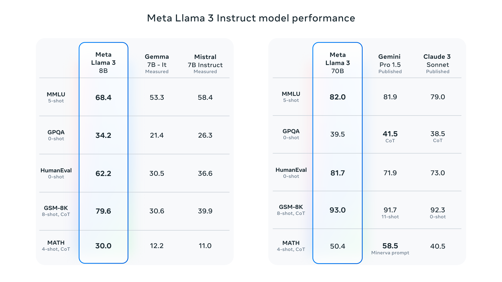

# Llama 3

Família de modelos desenvolvidos pela Meta Inc., é uma nova tecnologia de ponta, disponível em diversos tamanhos com bilhões parâmetros (pré-treinados ou ajustados para instruções (instruction-tuned)).

Os modelos Llama 3 instruction-tuned tem fine-tuning e otimizações para casos de uso de diálogo/chat, superando muitos dos modelos de chat de código aberto disponíveis em benchmarks comuns.

---
## 🔍 Características Principais

- **Desenvolvido por:** Meta AI
- **Arquitetura:** Baseada em Transformers, decoder-only.
- **Tokenizer**: Tiktoken
- **Janela de Contexto**: 8192 tokens
- **Número de parâmetros**: 8B, 70B
- **Dados de treinamento**: 15T de token
- **Mecanismo de atenção**: Grouped-query attention
- **Número de línguas suportadas**: 30 línguas
- **Características**
  - Modelos fine-tuned.
  - Aprendizado reforçado com feedback humano.

---
## 🧪 Desempenho em Benchmarks

## **Comparação com outros modelos**

Fonte: [https://ai.meta.com/blog/meta-llama-3/](https://ai.meta.com/blog/meta-llama-3/)

---
## 📥 Versões

O Llama 3 atualmente está disponível em 3 versões.

## **Llama 3.1**:
- Disponível com tamanhos entre 8B e 405B.
- Pre-treinado com 15T de tokens.

## **Llama 3.2**:
- Multilíngue.
- Instruction-tuned.
- Disponível com tamanhos entre 1B e 3B.
- (text in/text out)

## **Llama 3.2 Vision**:
- Disponível com tamanhos entre 11B e 90B.
- (text in + images in/text out)

## **Llama 3.3**:
- Multilíngue.
- Instruction-tuned.
- (text in/text out)
- Tamanho de 70B

---
## ✅ Prós
- Ideal para tarefas (textuais) mais exigentes, como raciocínio, codificação e testes de proficiência.
- Ajustado para tarefas baseadas em instruções.
- Otimizado para diálogos e interações em chat.

---
## ❌ Contras
- Janela de contexto relativamente pequena (8k tokens).
- Incapaz ou limitado, no caso do LLama 3.2 Vision, para tarefas multimodais.
- Aborda relativamente poucas línguas (30).

## 🚀 Como Usar 

---
## 📜 Fontes

https://ai.meta.com/blog/meta-llama-3/

https://huggingface.co/meta-llama

https://docs.llama-api.com/quickstart

https://www.datacamp.com/pt/tutorial/run-llama-3-locally

https://lightning.ai/fareedhassankhan12/studios/building-llama-3-from-scratch

https://datasciencedojo.com/blog/llama-model-debate/

